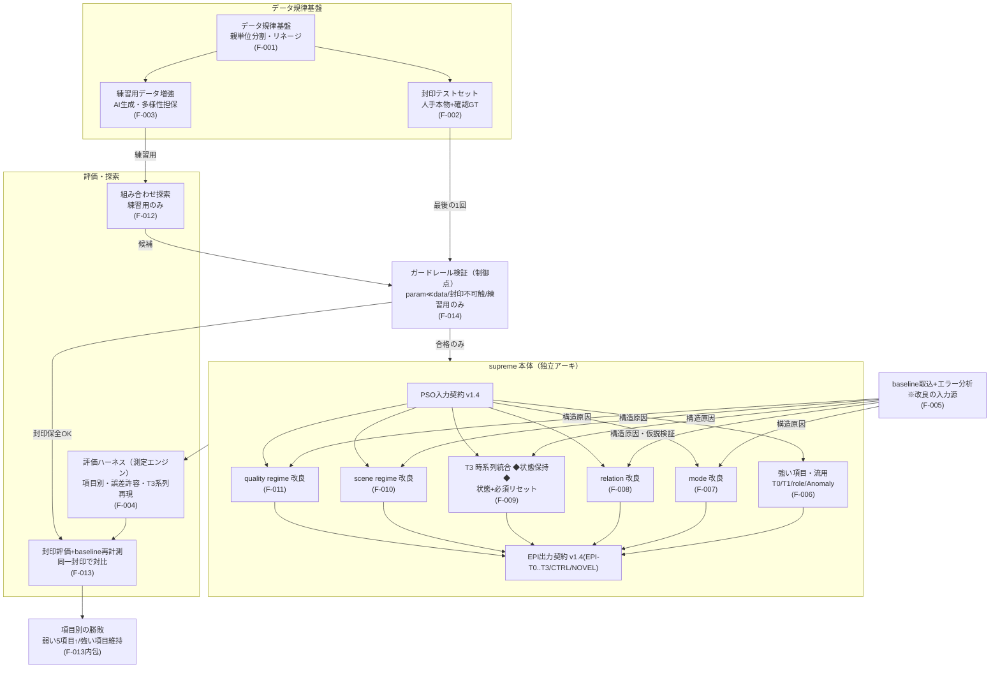
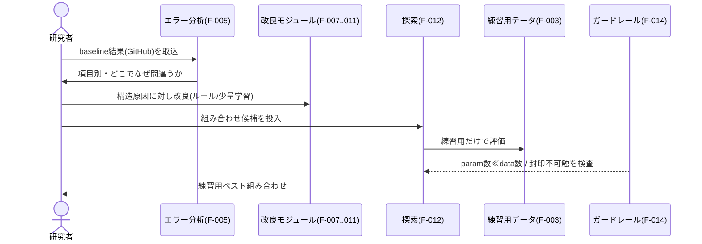
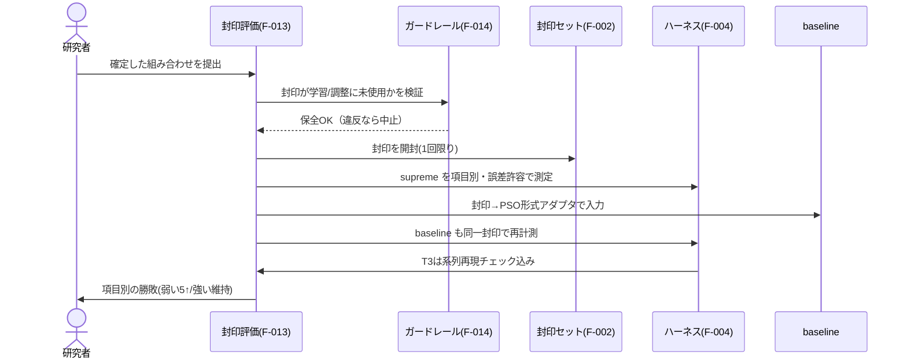
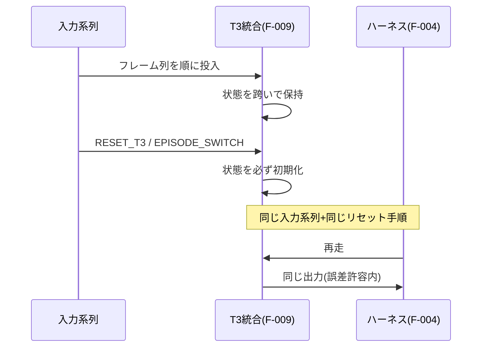

# アーキテクチャ図 — NS-EPI L4 supreme（新アーキ）

> フェーズ1で生成。`specs/ARCHITECTURE.md` として配置する。
> 図のノードID は `specs/status.json` の `nodes[].id` と一致させること（一致していれば進捗で自動色分け）。
> 段階3-6の図検証を反映済み: F-005 の動線を改良入力として明示／`verdict` を F-013 出力の内包ノードと注記／`guard` を評価前の制御点として実線化／`t3` に状態保持の特殊性を注記。

## システム構成図

各ノードに機能ID（F-XXX）を併記。ノードIDは status.json と揃える（英数小文字）。

## データフロー（主要ユースケース）

### UC-1: エラー分析 → 改良 → 探索（開発の中心ループ）

### UC-2: 封印評価（最後に一度だけ・公平な勝敗）

### UC-3: T3 の系列再現性（決定性の担保）

## コンポーネント責務

| ノードID | 名称 | 責務 | 担当機能 |
| --- | --- | --- | --- |
| `datagov` | データ規律基盤 | シナリオ+GT を親系統単位で管理。練習/封印を親が跨がぬよう分割し、版・親子リネージを推移閉包で記録。GT単一スキーマを保持。全データ操作の土台。 | F-001 |
| `sealset` | 封印テストセット | 人手の本物シナリオ＋人確認GTを少数。学習・調整に不可触。最終評価で一度だけ開封。**開封の正規経路は `open_eval_session`**（内部 guard に SearchGate を被せ aggregate を強制し、生涯計数を消費＋永続化する経路合成・ADR 0010決定2/0023決定1）。 | F-002 |
| `augment` | 練習用データ増強 | AI生成で練習用の量を確保。入力中心・GTは別系統で確定。多様性担保手段は未決定(U12)。 | F-003 |
| `erroran` | baseline取込+エラー分析 | GitHubの baseline結果を取込み、項目別にどこで・なぜ間違うかを抽出。改良の方向を構造原因から決める「改良の入力源」。 | F-005 |
| `strong` | 強い項目・流用 | T0/T1/role を baseline ロジックから**独立再実装**（U9 確定・ADR 0017）。ルール層のみ（T0=閾値+siren下限〔safety latch は risk_safe 用＝採点外・除外〕/ T1=状態機械 / role=logit）。実行時非リンク（F-006-2 機械チェック）。Anomaly は採点外（ADR 0012）で上流入力。δ_strong は F-013 で測定。 | F-006 |
| `mode` | mode 改良 | T2 mode を改良。安全優先の局所ヒステリシス（ADR 0015・logit層の後段。証拠抽出は上流）。 | F-007 |
| `relation` | relation 改良 | T2 relation を改良。配線漏れ仮説は F-005 で**棄却**。改良は addressing 発火条件の再設計＋grouped 較正（ADR 0016・logit ルール層のみ。証拠抽出は上流）。 | F-008 |
| `t3` | T3 時系列統合（状態保持） | エピソード単位統合。**有界窓+エピソード集約**（持続conv比率/切替率/flip累積/posterior集約）に局所ロジスティック少量学習（ADR 0020）。**注入リセット**で初期化（U4 確定・無限累積なし）。F-009-1 再現性・F-009-2 リセット初期化を機械検証。状態を持つ特殊ノード。学習可能 param 6≪予算100（U24）。証拠抽出・T2 は上流。**Phase4（ADR 0026）: 観測品質下限ゲート（`posterior(h_q)<0.40 ∧ env系→uncertain_context`）で h_q→t3 の死配線を結線し env 過剰断定を是正（偽陽性ゼロ・CV held-out +0.033）。** | F-009 |
| `scene` | scene regime 改良 | Scene regime を改良。**少量学習＝HGF 階層ボラティリティ**（ADR 0019）。HGF 3層で潜在水準＋ボラティリティを階層推定（層2が持続的変化を捕捉＝1ステップ drift の見逃しを是正）＋持続性特徴＋3クラス分類（DEGRADING含む）。学習可能 param ~9（HGF6+閾値）≪予算100（U24）。HGF は supreme 独立実装（共有基盤・将来 quality/anomaly でも再利用可）。診断抽出は上流。 | F-010 |
| `quality` | quality regime 改良 | Quality regime を改良。中身はU1/U3確定後。 | F-011 |
| `harness` | 評価ハーネス（測定エンジン） | 項目別スコアを誤差許容で測定。T3は系列再現チェック込み。指標式・許容幅は未決定(U10/U5)。F-013から呼ばれる再利用エンジン。 | F-004 |
| `search` | 組み合わせ探索 | 練習用のみで組み合わせを選定。探索空間=5改良モジュール構成・手法=決定的greedy座標上昇・停止=試行上限50/patience10（U8/U18 確定・ADR 0021）。封印は一切触らない（F-012-1・封印非アクセスを機械検証）。ガードレール違反候補は不採用。スコアラ（supreme end-to-end）は F-基盤-001 が供給。 | F-012 |
| `core` | supreme統合ランナー | 上流共有基盤（ADR 0022）。`run_supreme(PSO入力系列, params=None)→trace(8層view)`。gate→証拠抽出→観測式+HGF→段2 mode logits→全モジュール結線→8層view組み立て。決定的・独立性機械検証・Snapshotのみ・v1.4語彙。epiin/epiout stage を実装。F-012スコアラ・F-013封印評価を実走可能に。**Phase1b（ADR 0025）: `fit_supreme(練習,gt)→SupremeParams` で t3/scene を練習データから学習し `run_supreme(params=)`/`sealeval(params=)` へ注入（学習は練習のみ・封印は不可触・`params=None` 後方互換）。** | F-基盤-001 |
| `sealeval` | 封印評価+baseline再計測 | 確定組み合わせを封印で一度評価。baselineも同一封印で再計測し、同じ土俵（canonical 8層）で項目別に対比。封印→PSOアダプタ・baseline取り込みI/Fを持つ。開封は `open_eval_session` を唯一経路として1回（全GTを単一トークン下でread→revoke）。verdict は弱5=win/lose/draw（δ_strong引分）・強3=維持/劣化で、「弱5↑∧強維持」は成功目標（合否ゲートでない）。本番PSO入力源・baseline実測値は研究者手動seam（ADR 0023）。 | F-013 |
| `guard` | ガードレール検証（制御点） | param数≪data数／封印不可触／選定は練習用のみ（＋撤退基準候補）を機械検査。探索・封印評価の**前に違反を止める**制御点。封印の**開封トークン**（評価フェーズの機械的定義）の発行・失効も担う。 | F-014 |

## 図とコードの整合性について

この図は「設計の記録」かつ「進捗の地図」。実装が進んで図と実コードがズレると地図として信用できないため、`auditor` が各機能の監査時に「図 vs コード」の一致も確認する。ズレを見つけたら本ファイルと `status.json` を更新すること。

**本図の既知の注意点（段階3-6）**:
- `verdict` は独立機能ではなく F-013 の出力を可視化したノード（status.json には node として持つが feature は F-013 を指す）。
- `guard`(F-014) は単一ノードだが複数地点（探索前・封印評価前）で発火する横断的制御点。status.json 上は1ノードだが、edges は制御点として複数本張る。
- `t3`(F-009) は状態を持つ唯一の本体ノード。再現性の定義が他ノードと異なる（系列＋リセット手順単位）。
